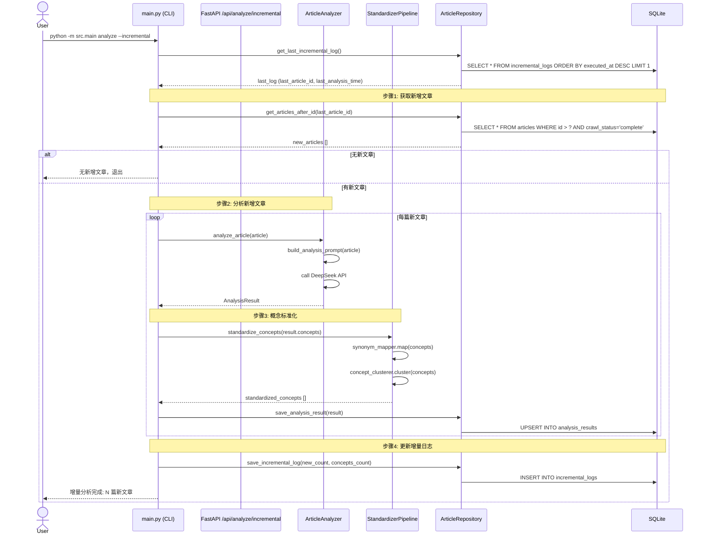
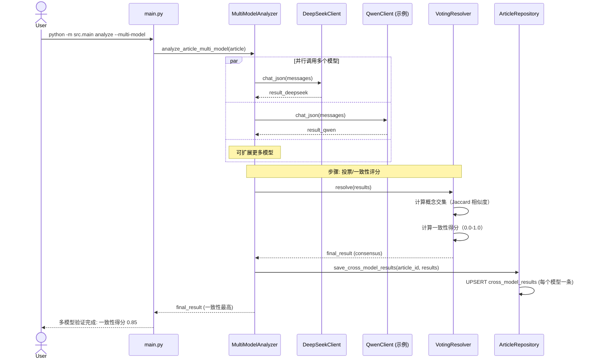
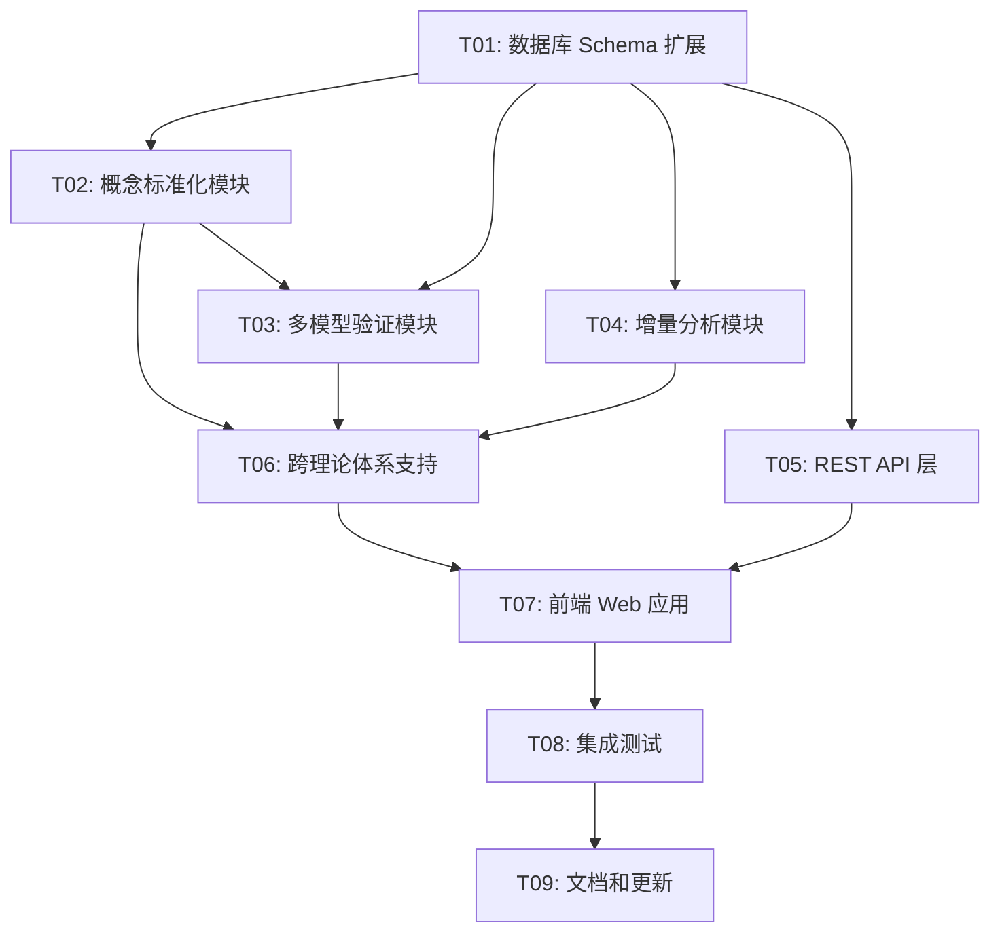

# 架构设计文档 v2.0 — 微信公众号文章采集与理论收敛分析工具

> **项目名称**: wechat_article_analyzer
> **技术栈**: Python 3.13 + Playwright + DeepSeek API + SQLite + Click CLI + React + MUI + Tailwind CSS
> **文档版本**: 2.0
> **日期**: 2026-06-19（规划设计）/ 2026-06-21（实现更新）
> **作者**: 资深软件架构师

> ⚠️ **实现状态说明**（2026-06-21 更新）：
> - ✅ **已实现**：v2.0 Web 界面（FastAPI 后端 + React 前端）、概念图谱可视化、文章全文格式显示、按文章 ID 过滤概念子图
> - ⏳ **部分实现**：概念标准化（框架已规划，代码未实现）、多模型验证（同上）
> - 📋 **规划中**：增量分析、跨理论体系支持、概念聚类
> - 本文档为 **v2.0 规划设计**，实际已实现的 v2.0 功能以 `docs/ARCHITECTURE.md` 附录 A 为准。

---

## 目录

- [1. 实现方案概述](#1-实现方案概述)
- [2. 框架选型](#2-框架选型)
- [3. 文件列表及相对路径](#3-文件列表及相对路径)
- [4. 数据结构和接口设计](#4-数据结构和接口设计)
- [5. 程序调用流程](#5-程序调用流程)
- [6. 任务分解列表](#6-任务分解列表)
- [7. 依赖包列表](#7-依赖包列表)
- [8. 共享知识约定](#8-共享知识约定)
- [9. 待明确事项](#9-待明确事项)

---

## 1. 实现方案概述

### 1.1 整体思路

在现有分层架构上扩展，采用**渐进式演进**策略：

```
┌─────────────────────────────────────────────────────────────────┐
│                    CLI 交互层 (main.py)                    │
│        login / crawl / analyze / report / graph / status     │
│              config / incremental / standardize              │
├──────────────┬──────────────┬─────────────────────────────┤
│   采集模块    │   分析模块    │      报告与图谱模块         │
│  (crawler/)  │ (analyzer/)  │      (report/)              │
├──────────────┼──────────────┼─────────────────────────────┤
│               │  多模型验证   │  概念标准化层 (NEW)        │
│               │ (multi_model)│  synonym_mapper             │
│               │              │  concept_clusterer           │
├──────────────┴──────────────┼─────────────────────────────┤
│                   数据层 (database + models)              │
│        新增: synonym_maps / theory_systems / cross_model_  │
├─────────────────────────────────────────────────────────────┤
│              REST API 层 (api/) — NEW                   │
│              Flask/FastAPI + SQLAlchemy                    │
├─────────────────────────────────────────────────────────────┤
│              前端 Web 应用 (frontend/) — NEW             │
│          Vite + React + MUI + Tailwind CSS + D3.js       │
└─────────────────────────────────────────────────────────────┘
```

**核心变更点概要**：

1. **概念标准化层**（`src/standardizer/`）: 解决同义不同名问题
   - 基于规则的同义词映射（精确匹配）
   - 基于向量相似度的聚类（模糊匹配）
   
2. **多模型验证模块**（`src/analyzer/multi_model.py`）: 提升分析可靠性
   - 集成多个 LLM（DeepSeek + Qwen 等）
   - 投票/一致性评分机制

3. **REST API 层**（`src/api/`）: 为前端提供数据接口
   - Flask/FastAPI 实现
   - 支持概念图谱、演化时间线、跨理论对比等端点

4. **前端 Web 应用**（`frontend/`）: 交互式可视化
   - Vite + React 技术栈
   - MUI + Tailwind CSS 组件库
   - D3.js / vis-network / cytoscape.js 可视化

5. **增量分析支持**: 基于 `articles.crawl_status` 和 `analysis_results.analysis_time`
   - 只分析新增文章
   - 理论框架动态更新

6. **跨理论体系支持**: 扩展 `config.theory_pillars` 为多理论体系
   - 支持同时分析多个理论体系
   - 跨体系对比分析

### 1.2 设计原则

- **向前兼容**: 不破坏现有 CLI 命令和数据库 schema
- **模块化**: 新功能独立成模块，不影响现有代码
- **可配置**: 所有新功能可通过配置文件开启/关闭
- **零外部依赖偏好**: 概念聚类优先使用标准库，必要时引入轻量依赖

---

## 2. 框架选型

### 2.1 概念聚类

| 方案 | 技术栈 | 优点 | 缺点 | 推荐 |
|------|--------|------|------|------|
| **方案 A** | `scikit-learn` TfidfVectorizer + cosine_similarity | 成熟稳定、文档完善 | 增加依赖 ~15MB | ✅ 推荐 |
| **方案 B** | `sentence-transformers` (all-MiniLM-L6-v2) | 语义理解准确 | 模型文件 ~80MB、推理慢 | 备选 |
| **方案 C** | 纯标准库（编辑距离 + Jaccard 相似度） | 零依赖 | 准确度较低 | 基础方案 |

**最终推荐**：方案 A（scikit-learn）
- 概念数量级（~1000）下性能足够
- TF-IDF 向量化简单高效
- 可解释性强

### 2.2 交互式可视化

| 技术 | 选型 | 理由 |
|------|------|------|
| **构建工具** | Vite | 快速冷启动、HMR 热更新 |
| **前端框架** | React 18 | 组件化、生态成熟 |
| **UI 组件库** | MUI (Material-UI) | 企业级组件、Theme 定制方便 |
| **CSS 框架** | Tailwind CSS | utility-first、快速原型 |
| **图谱可视化** | D3.js + React-D3-tree | 高度定制、社区资源丰富 |
| **备选图谱** | vis-network / cytoscape.js | 开箱即用、性能好（大图优选） | 

**最终技术栈**：
- Vite + React + MUI + Tailwind CSS
- 图谱: vis-network（推荐，性能优于 D3.js 大图场景）
- 时间线: Nivo 或 Recharts

### 2.3 API 层

| 方案 | 技术栈 | 优点 | 缺点 |
|------|--------|------|------|
| **方案 A** | Flask | 轻量、简单、Python 生态 | 性能一般 |
| **方案 B** | FastAPI | 高性能、自动生成 OpenAPI 文档、异步支持 | 学习曲线略高 |

**最终推荐**：FastAPI
- 原生支持异步（适合 LLM API 调用）
- 自动生成交互式 API 文档（/docs）
- Pydantic 数据验证

---

## 3. 文件列表及相对路径

```
wechat-article-analyzer/
├── requirements.txt                    (MODIFIED) — 新增依赖
├── pyproject.toml                      (MODIFIED) — 新增 frontend 构建脚本
├── config.json                         (MODIFIED) — 新增多模型、理论体系配置
├── src/
│   ├── models.py                       (MODIFIED) — 新增 SynonymMap, CrossModelResult, TheorySystem 表
│   ├── database.py                     (MODIFIED) — 新增表 DDL 和 Repository 方法
│   ├── config.py                      (MODIFIED) — 新增多模型配置字段
│   ├── standardizer/                  (NEW) — 概念标准化模块
│   │   ├── __init__.py
│   │   ├── synonym_mapper.py          — 同义词映射引擎（规则 + 手动配置）
│   │   ├── concept_clusterer.py       — 概念聚类引擎（TF-IDF + 余弦相似度）
│   │   └── standardizer_pipeline.py   — 标准化流水线（两阶段）
│   ├── analyzer/
│   │   ├── multi_model.py             (NEW) — 多模型交叉验证
│   │   ├── deepseek_client.py         (MODIFIED) — 支持多 API Key 配置
│   │   └── article_analyzer.py       (MODIFIED) — 集成概念标准化
│   ├── api/                          (NEW) — REST API 层
│   │   ├── __init__.py
│   │   ├── app.py                     — FastAPI 应用入口
│   │   ├── routes/                   — 路由模块
│   │   │   ├── __init__.py
│   │   │   ├── concept_routes.py      — 概念相关端点
│   │   │   ├── evolution_routes.py    — 演化时间线端点
│   │   │   ├── cross_theory_routes.py — 跨理论体系端点
│   │   │   └── analyze_routes.py     — 增量分析端点
│   │   └── schemas/                  — Pydantic 请求/响应模型
│   │       ├── __init__.py
│   │       └── api_models.py
│   └── report/                       (MODIFIED) — 支持跨理论体系报告
│       └── convergence_report.py       (MODIFIED)
├── frontend/                         (NEW) — Vite + React 前端项目
│   ├── package.json
│   ├── vite.config.js
│   ├── tailwind.config.js
│   ├── postcss.config.js
│   ├── index.html
│   ├── public/
│   └── src/
│       ├── App.jsx
│       ├── index.jsx
│       ├── components/                 — 组件库
│       │   ├── ConceptGraph.jsx        — 概念图谱可视化
│       │   ├── EvolutionTimeline.jsx   — 演化时间线
│       │   ├── CrossTheoryCompare.jsx  — 跨理论对比
│       │   └── IncrementalAnalysis.jsx — 增量分析面板
│       ├── pages/                     — 页面组件
│       │   ├── Dashboard.jsx
│       │   ├── ConceptExplorer.jsx
│       │   └── TheoryComparison.jsx
│       ├── services/                   — API 调用服务
│       │   └── apiClient.js
│       └── styles/                    — 全局样式
│           └── index.css
├── data/                               — 运行时数据目录
│   ├── synonym_dict.json              (NEW) — 同义词词典（手动配置）
│   └── theory_systems.json           (NEW) — 理论体系定义
├── output/                             
│   └── standardized_concepts.json    (NEW) — 标准化后概念映射
└── docs/
    ├── ARCHITECTURE.md                 — v1.0 架构文档（保留）
    ├── ARCHITECTURE-v2.md            (NEW) — 本文档
    └── PRD-v2.md                    (NEW) — v2.0 产品需求文档
```

### 3.1 文件变更说明

| 文件 | 变更类型 | 变更内容 |
|------|----------|------------|
| `src/models.py` | MODIFIED | 新增 `SynonymMap`, `CrossModelResult`, `TheorySystem` dataclass |
| `src/database.py` | MODIFIED | 新增 3 张表 DDL 和对应 Repository 方法 |
| `src/config.py` | MODIFIED | 新增 `multi_model_config`, `theory_systems` 配置字段 |
| `src/analyzer/multi_model.py` | NEW | 多模型交叉验证实现 |
| `src/standardizer/synonym_mapper.py` | NEW | 同义词映射引擎 |
| `src/standardizer/concept_clusterer.py` | NEW | 概念聚类引擎 |
| `src/api/` | NEW | FastAPI REST API 层 |
| `frontend/` | NEW | Vite + React 前端项目 |

---

## 4. 数据结构和接口设计

### 4.1 新增数据库表 schema（SQL DDL）

```sql
-- ============================================================
-- 同义词映射表 — 存储概念标准化映射关系
-- ============================================================
CREATE TABLE IF NOT EXISTS synonym_maps (
    id                  INTEGER PRIMARY KEY AUTOINCREMENT,
    original_concept    TEXT NOT NULL,                -- 原始概念名
    standardized_concept TEXT NOT NULL,                -- 标准化后概念名
    mapping_type        TEXT DEFAULT 'manual'          -- manual / auto_clustered
                            CHECK(mapping_type IN ('manual','auto_clustered')),
    confidence          REAL DEFAULT 1.0,             -- 置信度（0.0-1.0）
    created_at          TEXT DEFAULT (datetime('now')),
    updated_at          TEXT DEFAULT (datetime('now')),
    UNIQUE(original_concept)
);

-- ============================================================
-- 多模型验证结果表 — 存储多模型交叉验证结果
-- ============================================================
CREATE TABLE IF NOT EXISTS cross_model_results (
    id                  INTEGER PRIMARY KEY AUTOINCREMENT,
    article_id          INTEGER NOT NULL,
    model_name          TEXT NOT NULL,                -- deepseek / qwen / etc.
    concepts            TEXT,                         -- JSON array
    keywords            TEXT,                         -- JSON array
    theory_pillars      TEXT,                         -- JSON array
    summary             TEXT,
    consistency_score   REAL,                         -- 与其他模型的一致性得分
    created_at          TEXT DEFAULT (datetime('now')),
    FOREIGN KEY (article_id) REFERENCES articles(id),
    UNIQUE(article_id, model_name)
);

-- ============================================================
-- 理论体系表 — 支持多理论体系定义和对比
-- ============================================================
CREATE TABLE IF NOT EXISTS theory_systems (
    id                  INTEGER PRIMARY KEY AUTOINCREMENT,
    system_name         TEXT UNIQUE NOT NULL,         -- 理论体系名称
    description         TEXT,                         -- 理论体系描述
    pillars             TEXT,                         -- JSON array: 理论支柱列表
    color_code          TEXT DEFAULT '#000000',       -- 可视化颜色代码
    created_at          TEXT DEFAULT (datetime('now')),
    updated_at          TEXT DEFAULT (datetime('now'))
);

-- ============================================================
-- 增量分析日志表 — 记录每次增量分析的时间戳和结果
-- ============================================================
CREATE TABLE IF NOT EXISTS incremental_logs (
    id                  INTEGER PRIMARY KEY AUTOINCREMENT,
    last_article_id     INTEGER,                      -- 上次分析到的文章 ID
    last_analysis_time  TEXT,                         -- 上次分析完成时间
    new_articles_count INTEGER DEFAULT 0,            -- 新增文章数
    new_concepts_count  INTEGER DEFAULT 0,            -- 新增概念数
    executed_at         TEXT DEFAULT (datetime('now'))
);

-- ============================================================
-- 新增索引
-- ============================================================
CREATE INDEX IF NOT EXISTS idx_synonym_original ON synonym_maps(original_concept);
CREATE INDEX IF NOT EXISTS idx_synonym_standard  ON synonym_maps(standardized_concept);
CREATE INDEX IF NOT EXISTS idx_cross_model_article ON cross_model_results(article_id);
CREATE INDEX IF NOT EXISTS idx_cross_model_model    ON cross_model_results(model_name);
CREATE INDEX IF NOT EXISTS idx_theory_system_name  ON theory_systems(system_name);
```

### 4.2 API 端点设计（RESTful）

#### 4.2.1 概念相关端点

| 方法 | 端点 | 描述 | 请求体 | 响应 |
|------|------|------|--------|------|
| GET | `/api/concepts` | 获取所有概念（标准化后） | - | `{concepts: [{id, name, frequency, ...}]}` |
| GET | `/api/concepts/{concept_name}` | 获取概念详情 | - | `{name, frequency, articles: [...]}` |
| GET | `/api/concepts/search?q={keyword}` | 搜索概念 | - | `{results: [...]}` |
| POST | `/api/concepts/standardize` | 触发概念标准化 | - | `{mappings: [...]}` |
| GET | `/api/synonym-maps` | 获取同义词映射 | - | `{mappings: [...]}` |
| POST | `/api/synonym-maps` | 添加同义词映射 | `{original, standardized}` | `{id, ...}` |
| DELETE | `/api/synonym-maps/{id}` | 删除同义词映射 | - | `{success: true}` |

#### 4.2.2 概念图谱端点

| 方法 | 端点 | 描述 | 请求体 | 响应 |
|------|------|------|--------|------|
| GET | `/api/concept-graph?top_n=50` | 获取概念图谱数据 | - | `{nodes: [...], edges: [...]}` |
| GET | `/api/concept-graph/export?format=json` | 导出图谱 | - | 文件下载 |
| POST | `/api/concept-graph/layout` | 计算图谱布局 | `{algorithm: "force"}` | `{nodes: [...]}` |

#### 4.2.3 演化时间线端点

| 方法 | 端点 | 描述 | 请求体 | 响应 |
|------|------|------|--------|------|
| GET | `/api/evolution?concepts={c1},{c2}` | 获取演化时间线 | - | `{timeline: [...]}` |
| GET | `/api/evolution/summary` | 获取演化摘要 | - | `{summary: {...}}` |

#### 4.2.4 跨理论体系端点

| 方法 | 端点 | 描述 | 请求体 | 响应 |
|------|------|------|--------|------|
| GET | `/api/theory-systems` | 获取所有理论体系 | - | `{systems: [...]}` |
| POST | `/api/theory-systems` | 创建理论体系 | `{name, pillars}` | `{id, ...}` |
| GET | `/api/cross-theory/compare?systems={s1},{s2}` | 跨体系对比 | - | `{comparison: {...}}` |

#### 4.2.5 增量分析端点

| 方法 | 端点 | 描述 | 请求体 | 响应 |
|------|------|------|--------|------|
| POST | `/api/analyze/incremental` | 触发增量分析 | `{limit: 100}` | `{new_articles: 10, ...}` |
| GET | `/api/analyze/status` | 获取分析状态 | - | `{pending: 5, complete: 100, ...}` |

#### 4.2.6 多模型验证端点

| 方法 | 端点 | 描述 | 请求体 | 响应 |
|------|------|------|--------|------|
| POST | `/api/analyze/multi-model` | 触发多模型验证 | `{article_ids: [...]}` | `{task_id: "..."}` |
| GET | `/api/analyze/multi-model/{task_id}` | 查询验证进度 | - | `{status: "running", progress: 50}` |

### 4.3 前端组件树结构

```
App.jsx
├── Layout (MUI AppBar + Drawer)
│   ├── Sidebar (导航菜单)
│   └── MainContent
│       ├── Dashboard.jsx                    — 仪表盘（统计概览）
│       │   ├── StatsCards                  — 文章数/概念数/理论体系数
│       │   └── RecentActivity            — 最近分析活动
│       ├── ConceptExplorer.jsx            — 概念浏览器
│       │   ├── ConceptGraph.jsx           — 交互式概念图谱（vis-network）
│       │   ├── ConceptList.jsx           — 概念列表（搜索 + 排序）
│       │   └── ConceptDetail.jsx         — 概念详情（频次/共现/文章列表）
│       ├── EvolutionTimeline.jsx          — 演化时间线
│       │   ├── TimelineChart.jsx         — 时间线图表（Recharts）
│       │   └── ConceptSelector.jsx      — 概念选择器（多选）
│       ├── TheoryComparison.jsx           — 跨理论体系对比
│       │   ├── TheorySystemManager.jsx   — 理论体系管理
│       │   └── ComparisonView.jsx       — 对比视图（并列/叠加）
│       ├── MultiModelValidation.jsx       — 多模型验证面板
│       │   ├── ModelConfig.jsx          — 模型配置（API Key/参数）
│       │   └── ValidationResults.jsx    — 验证结果（一致性得分）
│       └── Settings.jsx                  — 设置页面
│           ├── SynonymDictEditor.jsx     — 同义词词典编辑器
│           └── StandardizationConfig.jsx — 标准化配置
└── ThemeProvider (MUI + Tailwind CSS)
```

---

## 5. 程序调用流程

### 5.1 增量分析流程



### 5.2 多模型交叉验证流程



### 5.3 概念标准化 Pipeline

```mermaid
flowchart TD
    A[原始概念列表] --> B[阶段1: 规则映射]
    B --> B1[加载 synonym_dict.json]
    B1 --> B2[精确匹配同义词]
    B2 --> B3[输出: 部分标准化概念]
    
    B3 --> C[阶段2: 向量聚类]
    C --> C1[TF-IDF 向量化]
    C1 --> C2[计算余弦相似度]
    C2 --> C3[聚类（DBSCAN / 阈值）]
    C3 --> C4[输出: 聚类中心作为标准化概念]
    
    C4 --> D[合并结果]
    D --> E[保存 synonym_maps 表]
    E --> F[更新 analysis_results (标准化后概念)]
    
    F --> G[重新构建概念共现矩阵]
    G --> H[输出: 标准化后概念图谱]
```

---

## 6. 任务分解列表

### 任务依赖关系图



### T01: 数据库 Schema 扩展

| 项 | 内容 |
|------|------|
| **任务描述** | 新增 4 张表：synonym_maps、cross_model_results、theory_systems、incremental_logs。修改现有表的索引和字段。 |
| **源文件** | `src/database.py` (MODIFIED), `src/models.py` (MODIFIED) |
| **依赖** | 无 |
| **优先级** | P0 |
| **复杂度** | 低 |
| **验收标准** | ① 运行 `python -m src.main status` 自动创建新表；② 数据库迁移脚本能正确从 v1.0 升级到 v2.0；③ 新表的 CRUD 方法通过单元测试 |

### T02: 概念标准化模块

| 项 | 内容 |
|------|------|
| **任务描述** | 实现两阶段概念标准化：① 基于规则的同义词映射（加载 synonym_dict.json）；② 基于 TF-IDF + 余弦相似度的概念聚类。输出标准化后的概念映射关系并存储到 synonym_maps 表。 |
| **源文件** | `src/standardizer/__init__.py` (NEW), `src/standardizer/synonym_mapper.py` (NEW), `src/standardizer/concept_clusterer.py` (NEW), `src/standardizer/standardizer_pipeline.py` (NEW) |
| **依赖** | T01 |
| **优先级** | P0 |
| **复杂度** | 中 |
| **验收标准** | ① `python -m src.main standardize` 命令能执行标准化；② "刘原理" 和 "刘氏原理" 被正确映射为同一概念；③ 聚类结果可配置相似度阈值；④ 标准化后的概念图谱与原始图谱对比，节点数减少（合并后） |

### T03: 多模型验证模块

| 项 | 内容 |
|------|------|
| **任务描述** | 实现多 LLM 交叉验证：支持配置多个模型（DeepSeek、Qwen 等），并行调用，投票/一致性评分机制合并结果。结果存储到 cross_model_results 表。 |
| **源文件** | `src/analyzer/multi_model.py` (NEW), `src/analyzer/deepseek_client.py` (MODIFIED) |
| **依赖** | T01 |
| **优先级** | P1 |
| **复杂度** | 中 |
| **验收标准** | ① 配置两个模型后能并行调用；② 一致性得分计算正确（Jaccard 相似度）；③ 投票机制能正确选出共识结果；④ 结果可查询和对比 |

### T04: 增量分析模块

| 项 | 内容 |
|------|------|
| **任务描述** | 实现增量分析：基于 incremental_logs 表记录上次分析时间戳，只分析新增文章。支持 `--incremental` CLI 选项。 |
| **源文件** | `src/main.py` (MODIFIED), `src/analyzer/article_analyzer.py` (MODIFIED) |
| **依赖** | T01 |
| **优先级** | P0 |
| **复杂度** | 低 |
| **验收标准** | ① 第一次全量分析后，第二次加 `--incremental` 只分析新文章；② 理论框架动态更新（新增概念被纳入）；③ 增量日志正确记录 |

### T05: REST API 层

| 项 | 内容 |
|------|------|
| **任务描述** | 使用 FastAPI 实现 REST API：概念图谱、演化时间线、跨理论对比、增量分析等端点。提供 OpenAPI 文档。 |
| **源文件** | `src/api/__init__.py` (NEW), `src/api/app.py` (NEW), `src/api/routes/` (NEW), `src/api/schemas/` (NEW) |
| **依赖** | T01, T02, T03, T04 |
| **优先级** | P1 |
| **复杂度** | 中 |
| **验收标准** | ① 运行 `python -m src.api.app` 启动 API 服务；② 访问 `http://localhost:8000/docs` 能看到 Swagger UI；③ 所有端点返回正确数据；④ API 文档完整 |

### T06: 跨理论体系支持

| 项 | 内容 |
|------|------|
| **任务描述** | 扩展 config.theory_pillars 为多理论体系：支持同时分析多个理论体系，跨体系对比分析。修改 report 模块生成跨体系对比报告。 |
| **源文件** | `src/config.py` (MODIFIED), `src/report/convergence_report.py` (MODIFIED), `data/theory_systems.json` (NEW) |
| **依赖** | T01 |
| **优先级** | P1 |
| **复杂度** | 中 |
| **验收标准** | ① 可配置多个理论体系；② 报告包含跨体系对比章节；③ 理论体系可通过 API 管理 |

### T07: 前端 Web 应用

| 项 | 内容 |
|------|------|
| **任务描述** | 使用 Vite + React + MUI + Tailwind CSS 构建交互式 Web 应用：概念图谱可视化（vis-network）、演化时间线（Recharts）、跨理论对比面板。 |
| **源文件** | `frontend/` 整个目录 (NEW) |
| **依赖** | T02, T05, T06 |
| **优先级** | P1 |
| **复杂度** | 高 |
| **验收标准** | ① `cd frontend && npm install && npm run dev` 能启动开发服务器；② 概念图谱可交互（缩放/拖拽/点击查看详情）；③ 演化时间线可动态选择概念；④ 跨理论对比视图正确渲染 |

### T08: 集成测试

| 项 | 内容 |
|------|------|
| **任务描述** | 编写端到端集成测试：模拟完整流程（登录 → 采集 → 分析 → 标准化 → 多模型验证 → 报告生成 → 前端展示）。 |
| **源文件** | `tests/test_incremental.py` (NEW), `tests/test_standardizer.py` (NEW), `tests/test_multi_model.py` (NEW), `tests/test_api.py` (NEW) |
| **依赖** | T01-T07 |
| **优先级** | P1 |
| **复杂度** | 中 |
| **验收标准** | ① 所有新增模块的单元测试通过；② API 端点集成测试通过；③ 前端组件单元测试通过；④ 端到端流程测试通过 |

### T09: 文档和更新

| 项 | 内容 |
|------|------|
| **任务描述** | 更新 README.md、PRD、架构文档，编写用户使用指南（含新功能截图）。 |
| **源文件** | `README.md` (MODIFIED), `docs/PRD-v2.md` (NEW), `docs/ARCHITECTURE-v2.md` (本文档) |
| **依赖** | T01-T08 |
| **优先级** | P1 |
| **复杂度** | 低 |
| **验收标准** | ① 文档与代码实现一致；② 用户能根据文档正确使用新功能；③ 架构文档准确反映最终设计 |

---

## 7. 依赖包列表

### 7.1 后端新增 Python 包

```txt
# ============================================================
# 概念聚类
# ============================================================
scikit-learn==1.6.0             # TF-IDF 向量化 + 余弦相似度 + DBSCAN 聚类
numpy==2.2.0                    # scikit-learn 依赖

# ============================================================
# REST API
# ============================================================
fastapi==0.115.0                # 高性能 API 框架
uvicorn==0.32.0                 # ASGI 服务器
pydantic==2.10.0                # 数据验证
pydantic-settings==2.7.0        # 配置管理

# ============================================================
# 数据库迁移
# ============================================================
alembic==1.14.0                 # 数据库迁移工具（可选，若需要复杂迁移）

# ============================================================
# 实用工具
# ============================================================
tqdm==4.67.0                    # 进度条（API 批量处理）
```

### 7.2 前端 npm 包

```json
{
  "dependencies": {
    "react": "^18.3.0",
    "react-dom": "^18.3.0",
    "react-router-dom": "^6.28.0",
    "@mui/material": "^6.1.0",
    "@emotion/react": "^11.13.0",
    "@emotion/styled": "^11.13.0",
    "tailwindcss": "^3.4.0",
    "vis-network": "^9.1.0",
    "recharts": "^2.13.0",
    "axios": "^1.7.0",
    "date-fns": "^4.1.0",
    "@tanstack/react-query": "^5.62.0"
  },
  "devDependencies": {
    "vite": "^6.0.0",
    "@vitejs/plugin-react": "^4.3.0",
    "eslint": "^9.15.0",
    "prettier": "^3.4.0"
  }
}
```

---

## 8. 共享知识约定

### 8.1 命名规范

| 类型 | 规范 | 示例 |
|------|------|------|
| **文件名** | snake_case | `synonym_mapper.py` |
| **类名** | PascalCase | `SynonymMapper` |
| **函数名** | snake_case | `standardize_concepts()` |
| **常量** | UPPER_SNAKE_CASE | `DEFAULT_SIMILARITY_THRESHOLD` |
| **API 端点** | kebab-case | `/api/concept-graph` |
| **数据库表** | snake_case (plural) | `synonym_maps` |
| **数据库字段** | snake_case | `original_concept` |

### 8.2 错误处理模式

- **数据库操作**: 捕获 `sqlite3.Error`，记录日志，向上层抛出自定义异常
- **API 调用**: 使用 `tenacity` 重试（若引入），或手动实现指数退避
- **前端 API 调用**: 使用 `react-query` 自动重试和缓存

```python
# 自定义异常类（建议新增）
class StandardizationError(Exception):
    """概念标准化错误"""
    pass

class MultiModelError(Exception):
    """多模型验证错误"""
    pass
```

### 8.3 配置管理方式

- **向后兼容**: 新增配置项使用 `config.get("new_key", default_value)` 读取，避免 KeyError
- **多模型配置示例**:

```json
{
  "multi_model_config": {
    "enabled": true,
    "models": [
      {
        "name": "deepseek",
        "api_key_env": "DEEPSEEK_API_KEY",
        "base_url": "https://api.deepseek.com/v1",
        "model": "deepseek-chat"
      },
      {
        "name": "qwen",
        "api_key_env": "QWEN_API_KEY",
        "base_url": "https://dashscope.aliyuncs.com/compatible-mode/v1",
        "model": "qwen-turbo"
      }
    ],
    "voting_strategy": "majority"  // majority / weighted / consensus
  }
}
```

### 8.4 向前兼容策略

1. **数据库迁移**: 使用 `CREATE TABLE IF NOT EXISTS` 和 `ADD COLUMN IF NOT EXISTS`（SQLite 3.35+ 支持）
2. **CLI 命令**: 新增命令不影响现有命令，现有命令行为不变
3. **配置文件**: 旧配置文件能在新版本中使用（新增配置项使用默认值）
4. **API 版本控制**: 使用 `/api/v1/` 前缀，未来可扩展 `/api/v2/`

### 8.5 日志约定

- **新增模块日志前缀**: `[STANDARDIZER]`, `[MULTI_MODEL]`, `[API]`
- **日志级别**:
  - DEBUG: 详细的 API 请求/响应、聚类计算过程
  - INFO: 标准化进度、多模型验证进度
  - WARNING: 聚类阈值过低导致过多合并
  - ERROR: API 调用失败、数据库操作失败

---

## 9. 待明确事项

| # | 事项 | 当前假设 | 影响 |
|---|------|---------|------|
| 1 | **概念标准化阈值** | 假设余弦相似度阈值 0.8 能较好区分同义概念 | 需用户根据实际数据调整，建议提供命令行参数 `--similarity-threshold` |
| 2 | **多模型权重** | 假设各模型权重相同（多数投票） | 若某模型表现更好，需支持配置权重（weighted voting） |
| 3 | **前端部署方式** | 假设前后端分离部署（API 在不同端口） | 若需打包为单体应用，需配置 CORS 和静态文件服务 |
| 4 | **理论体系预定义** | 假设用户会提供理论体系定义文件 | 需提供示例 `theory_systems.json`，或支持从现有 `theory_pillars` 自动迁移 |
| 5 | **增量分析触发方式** | 假设手动触发（`--incremental`） | 是否需支持定时自动执行（cron job）？需添加调度器 |
| 6 | **概念图谱性能** | 假设概念数 < 1000，前端渲染无压力 | 若概念数过多，需实现虚拟化渲染或后端分页 |
| 7 | **多模型 API 成本** | 假设用户有多个模型的 API Key | 若成本过高，可实现"抽样验证"模式（只验证部分文章） |
| 8 | **同义词词典初始化** | 假设从空词典开始，用户手动添加 | 可提供"自动初始化"功能（从已有概念中自动发现同义词） |

---

## 附录 A: 关键技术决策

### A.1 为什么选择 TF-IDF 而非 Embedding？

- **概念数量级**: ~1000 概念，TF-IDF 足够准确
- **计算效率**: TF-IDF 矩阵计算快，无需 GPU
- **可解释性**: 可查看每个概念的 TF-IDF 向量，便于调试
- **零额外依赖**: scikit-learn 是轻量级依赖（相比 sentence-transformers 的 80MB 模型）

若未来概念数超过 10000 或需要更高语义准确度，可升级到 sentence-transformers。

### A.2 为什么选择 FastAPI 而非 Flask？

- **异步支持**: LLM API 调用是 I/O 密集型，异步能显著提升并发性能
- **自动文档**: 自动生成 Swagger UI，方便前后端联调
- **类型安全**: Pydantic 模型提供运行时类型检查
- **未来扩展**: 易于添加 WebSocket 支持（实时进度推送）

### A.3 为什么选择 vis-network 而非 D3.js？

- **性能**: vis-network 使用 Canvas 渲染，大图（>500 节点）性能优于 D3.js（SVG）
- **开箱即用**: 内置力导向布局、缩放、拖拽等交互，无需手写
- **社区**: 文档完善，Issue 响应快

若需要高度定制的可视化效果，可切换到 D3.js。

---

## 附录 B: 数据库迁移脚本示例

```python
# migrations/upgrade_v1_to_v2.py
import sqlite3

def upgrade(conn: sqlite3.Connection):
    """从 v1.0 升级到 v2.0"""
    
    # 1. 创建新表
    conn.execute("""
        CREATE TABLE IF NOT EXISTS synonym_maps (
            id                  INTEGER PRIMARY KEY AUTOINCREMENT,
            original_concept    TEXT NOT NULL,
            standardized_concept TEXT NOT NULL,
            mapping_type        TEXT DEFAULT 'manual',
            confidence          REAL DEFAULT 1.0,
            created_at          TEXT DEFAULT (datetime('now')),
            updated_at          TEXT DEFAULT (datetime('now')),
            UNIQUE(original_concept)
        )
    """)
    
    # ... 其他新表 DDL
    
    # 2. 迁移现有 theory_pillars 到 theory_systems 表
    conn.execute("""
        INSERT OR IGNORE INTO theory_systems (system_name, pillars, description)
        VALUES ('复合体理学', '["刘原理", "三视界法", "太乙预言机", "全息拓扑动力学"]', '默认理论体系')
    """)
    
    conn.commit()
    print("数据库迁移完成: v1.0 -> v2.0")

if __name__ == "__main__":
    import sys
    sys.path.insert(0, ".")
    from src.database import Database
    db = Database("data/articles.db")
    upgrade(db.get_connection())
```

---

> **架构设计完成。后续实现按任务列表 T01→T02→T03→T04→T05→T06→T07→T08→T09 顺序执行。**
