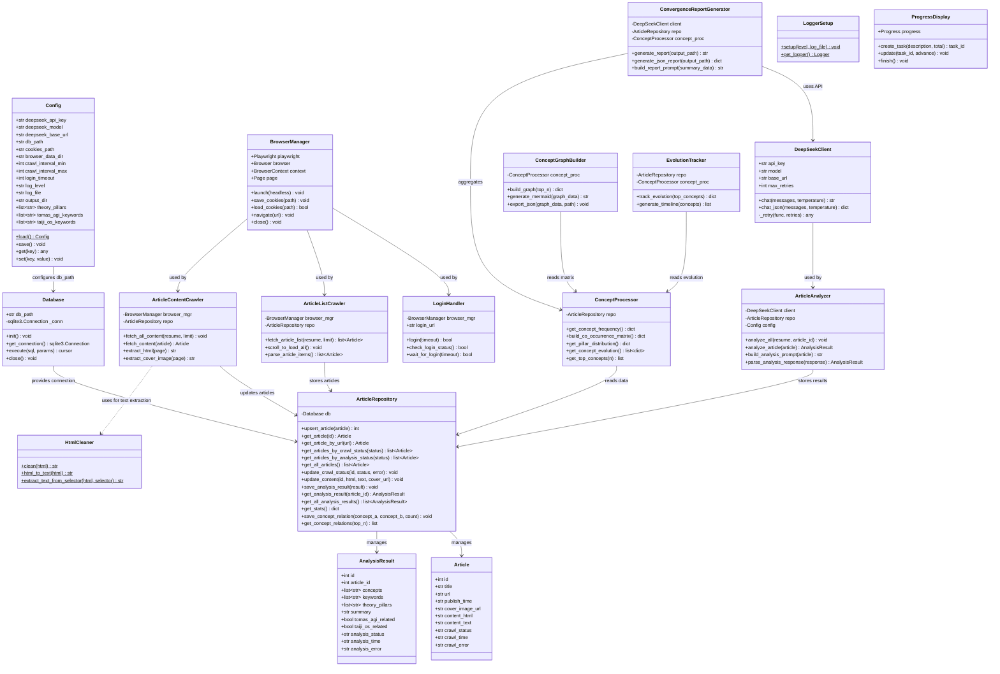
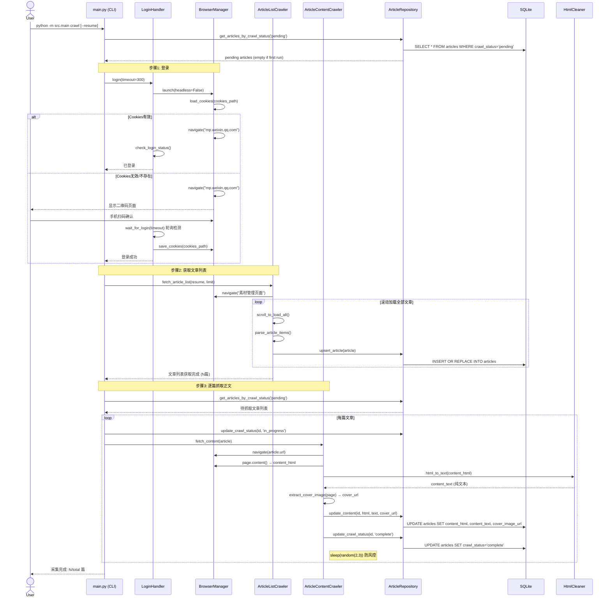
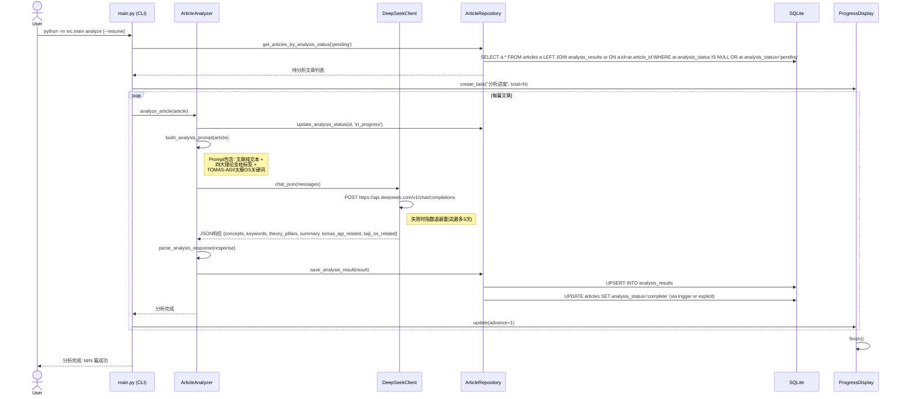
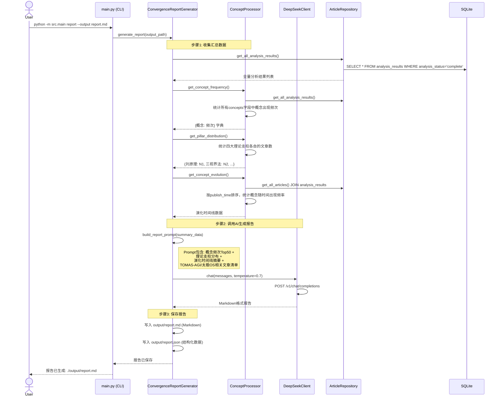
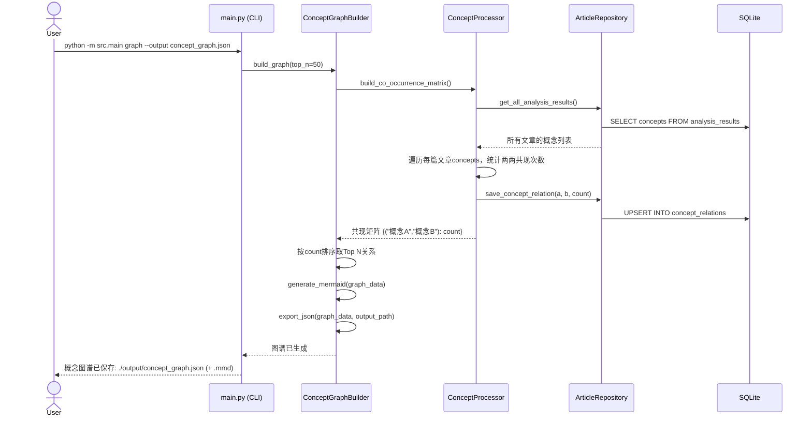
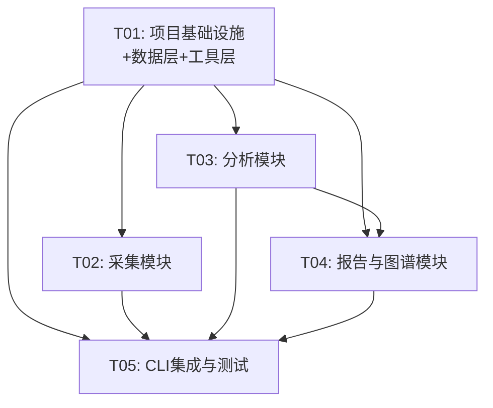

# 架构设计文档 — 微信公众号文章采集与理论收敛分析工具

> **项目名称**: wechat_article_analyzer
> **技术栈**: Python 3.13 + Playwright + DeepSeek API + SQLite + Click CLI
> **文档版本**: 1.0
> **日期**: 2026-06-18

---

## 目录

- [1. 实现方案与框架选型](#1-实现方案与框架选型)
- [2. 文件列表及相对路径](#2-文件列表及相对路径)
- [3. 数据结构与接口（类图）](#3-数据结构与接口类图)
- [4. 程序调用流程（时序图）](#4-程序调用流程时序图)
- [5. 任务列表](#5-任务列表)
- [6. 依赖包列表](#6-依赖包列表)
- [7. 共享知识（跨文件约定）](#7-共享知识跨文件约定)
- [8. 待明确事项](#8-待明确事项)

---

## 1. 实现方案与框架选型

### 1.1 整体架构

系统采用**分层架构**（Layered Architecture），分为四层：

```
┌─────────────────────────────────────────────────────────┐
│                    CLI 交互层 (main.py)                    │
│        login / crawl / analyze / report / graph          │
│              status / config                              │
├──────────────┬──────────────┬───────────────────────────┤
│   采集模块    │   分析模块    │      报告与图谱模块        │
│  (crawler/)  │ (analyzer/)  │      (report/)            │
│              │              │                           │
│ BrowserMgr   │ DeepSeekClnt │ ConvergenceReport         │
│ LoginHandler │ ArticleAnlzr │ ConceptGraph              │
│ ListCrawler  │ ConceptProc  │ EvolutionTracker          │
│ ContentCrawl │              │                           │
├──────────────┴──────────────┴───────────────────────────┤
│                   数据层 (database + models)              │
│            ArticleRepository / SQLite                     │
├───────────────────────────────────────────────────────────┤
│                   基础设施层 (utils + config)              │
│      Logger / Progress / HtmlCleaner / Config             │
└─────────────────────────────────────────────────────────┘
```

**设计原则**：
- **单一职责**：每个模块只负责一个功能域（采集/分析/报告）
- **依赖单向**：上层依赖下层，采集/分析/报告模块互不直接依赖（仅通过数据层共享数据）
- **可独立测试**：每个模块可独立运行和测试，通过 Repository 模式解耦数据库访问

### 1.2 框架选型说明

| 组件 | 选型 | 理由 |
|------|------|------|
| **浏览器自动化** | Playwright (sync API) | ① 原生支持 Chromium，反检测能力强于 Selenium；② 现代 SPA 渲染支持好（微信公众号后台是 SPA）；③ 内置 Cookie 持久化、自动等待机制；④ sync API 简单直观，适合 CLI 脚本；⑤ 无需 WebDriver 驱动管理 |
| **AI 分析** | DeepSeek API (deepseek-chat) | ① 中文理解能力强，适合中文公众号文章分析；② API 兼容 OpenAI 格式，可复用 openai SDK；③ 成本低于 GPT-4，适合 2000 篇批量分析 |
| **数据库** | SQLite (sqlite3 标准库) | ① 零配置，文件级存储，适合本地 CLI 工具；② Python 标准库内置，无需额外依赖；③ 支持事务、索引，满足 2000 篇数据量 |
| **CLI 框架** | Click | ① 命令组/子命令模式天然适配本项目多命令需求；② 类型参数、帮助文本自动生成；③ 生态成熟（Flask 同源） |
| **HTTP 客户端** | openai SDK (兼容模式) | ① DeepSeek API 兼容 OpenAI 格式，直接复用 openai SDK；② 内含重试、超时处理；③ 无需手写 HTTP 请求 |
| **HTML 解析** | BeautifulSoup4 + lxml | ① 微信公众号正文 HTML 结构相对规整，BS4 足够；② lxml 后端速度快；③ 可可靠去除 script/style/广告 |
| **日志** | loguru | ① 开箱即用，无需复杂配置；② 同时输出控制台和文件；③ 支持轮转、级别过滤 |
| **进度显示** | rich (Progress) | ① 美观的终端进度条；② 支持多任务并行显示；③ 与 Click 兼容好 |

### 1.3 关键技术决策

1. **Playwright sync API 而非 async**：CLI 工具为线性流程，sync API 代码更简洁、更易调试。采集间隔控制简单直观。

2. **Cookie 持久化策略**：登录成功后将 `BrowserContext` 的 cookies 导出为 JSON 文件存储。后续操作优先加载已有 cookies，若过期则提示重新登录。

3. **断点续抓策略**：基于 `articles.crawl_status` 和 `analysis_results.analysis_status` 字段实现。`--resume` 模式下跳过状态为 `complete` 的记录，仅处理 `pending`/`failed` 状态的记录。

4. **DeepSeek API 调用策略**：
   - 单篇分析：发送文章正文（纯文本，截断至 8000 字符以防 token 超限），要求返回 JSON 结构化结果
   - 全局报告：将所有文章的概念统计摘要（非全文）发送给 API，生成收敛报告
   - 重试机制：指数退避，最多 3 次重试

5. **四大理论支柱预定义**：作为固定标签传入分析 Prompt，要求 AI 从中标注文章所属支柱，同时允许提取其他概念。预定义支柱配置在 `config.json` 的 `theory_pillars` 字段中。

6. **防风控策略**：每篇文章抓取间隔 2-3 秒随机延迟；模拟人类滚动行为；使用持久化浏览器上下文（user-data-dir）保留登录态。

7. **TOMAS-AGI / 太极OS标注**：分析 Prompt 中包含关键词列表，要求 AI 判断文章是否与这两个项目相关，并在分析结果中设置标志位。

---

## 2. 文件列表及相对路径

```
wechat-article-analyzer/
├── requirements.txt                    # Python依赖声明
├── pyproject.toml                      # 项目元数据与构建配置
├── config.json                         # 运行时配置（首次运行自动生成）
├── src/
│   ├── __init__.py                     # 包标识
│   ├── main.py                         # CLI入口 — Click命令组定义所有子命令
│   ├── config.py                       # Config类 — 配置加载/保存/环境变量覆盖
│   ├── database.py                     # Database类 — SQLite连接管理、表初始化、DDL
│   ├── models.py                       # 数据模型 — Article/AnalysisResult dataclass
│   ├── crawler/
│   │   ├── __init__.py
│   │   ├── browser.py                  # BrowserManager — Playwright浏览器生命周期管理
│   │   ├── login.py                    # LoginHandler — 扫码登录、登录态检测、Cookie持久化
│   │   ├── article_list.py             # ArticleListCrawler — 文章列表批量获取（滚动加载+解析）
│   │   └── article_content.py          # ArticleContentCrawler — 正文HTML/纯文本/封面图抓取
│   ├── analyzer/
│   │   ├── __init__.py
│   │   ├── deepseek_client.py          # DeepSeekClient — API封装、重试、JSON响应解析
│   │   ├── article_analyzer.py         # ArticleAnalyzer — 单篇分析、Prompt构建、结果解析
│   │   └── concepts.py                 # ConceptProcessor — 概念频次统计、共现矩阵、演化追踪
│   ├── report/
│   │   ├── __init__.py
│   │   ├── convergence_report.py       # ConvergenceReportGenerator — 理论收敛报告生成
│   │   ├── concept_graph.py            # ConceptGraphBuilder — 概念关系图谱(Mermaid+JSON)
│   │   └── evolution_tracker.py        # EvolutionTracker — 理论演化脉络追踪
│   └── utils/
│       ├── __init__.py
│       ├── html_cleaner.py             # HTML清洗 — 去除脚本/样式/广告，转纯文本
│       ├── logger.py                   # 日志配置 — loguru初始化，控制台+文件双输出
│       └── progress.py                 # 进度显示 — rich Progress封装
├── tests/
│   ├── __init__.py
│   ├── test_database.py                # 数据库CRUD测试
│   ├── test_html_cleaner.py            # HTML清洗测试
│   ├── test_concepts.py                # 概念处理测试
│   └── test_deepseek_client.py         # DeepSeek客户端测试（mock）
├── data/                               # 运行时数据目录（.gitignore）
│   ├── articles.db                     # SQLite数据库文件
│   ├── cookies.json                    # 登录Cookie持久化
│   └── browser_data/                   # 浏览器用户数据目录
├── logs/                               # 日志目录（.gitignore）
│   └── app.log
├── output/                             # 报告输出目录
│   ├── report.md
│   ├── report.json
│   └── concept_graph.json
└── docs/
    ├── PRD.md
    ├── ARCHITECTURE.md                 # 本文档
    ├── class-diagram.mermaid           # 类图（独立文件）
    └── sequence-diagram.mermaid        # 时序图（独立文件）
```

---

## 3. 数据结构与接口（类图）

### 3.1 SQLite 表结构 (DDL)

```sql
-- ============================================================
-- 文章表 — 存储采集到的文章数据与采集状态
-- ============================================================
CREATE TABLE IF NOT EXISTS articles (
    id              INTEGER PRIMARY KEY AUTOINCREMENT,
    title           TEXT NOT NULL,
    url             TEXT UNIQUE NOT NULL,
    publish_time    TEXT,                          -- ISO 8601 格式
    cover_image_url TEXT,
    content_html    TEXT,
    content_text    TEXT,
    crawl_status    TEXT DEFAULT 'pending'          -- pending / in_progress / complete / failed
                    CHECK(crawl_status IN ('pending','in_progress','complete','failed')),
    crawl_time      TEXT,
    crawl_error     TEXT,
    created_at      TEXT DEFAULT (datetime('now')),
    updated_at      TEXT DEFAULT (datetime('now'))
);

-- ============================================================
-- 分析结果表 — 存储DeepSeek API单篇分析结果
-- ============================================================
CREATE TABLE IF NOT EXISTS analysis_results (
    id                  INTEGER PRIMARY KEY AUTOINCREMENT,
    article_id          INTEGER NOT NULL,
    concepts            TEXT,                      -- JSON array: ["概念A", "概念B", ...]
    keywords            TEXT,                      -- JSON array: ["关键词1", "关键词2", ...]
    theory_pillars      TEXT,                      -- JSON array: ["刘原理", "三视界法", ...]
    summary             TEXT,                      -- 文章理论摘要（1-2句）
    tomas_agi_related   INTEGER DEFAULT 0,         -- 0/1 是否与TOMAS-AGI项目相关
    taiji_os_related    INTEGER DEFAULT 0,         -- 0/1 是否与太极OS项目相关
    analysis_status     TEXT DEFAULT 'pending'     -- pending / in_progress / complete / failed
                        CHECK(analysis_status IN ('pending','in_progress','complete','failed')),
    analysis_time       TEXT,
    analysis_error      TEXT,
    created_at          TEXT DEFAULT (datetime('now')),
    updated_at          TEXT DEFAULT (datetime('now')),
    FOREIGN KEY (article_id) REFERENCES articles(id),
    UNIQUE(article_id)                               -- 一篇文章对应一条分析结果
);

-- ============================================================
-- 概念关系表 — 存储概念共现统计（P1）
-- ============================================================
CREATE TABLE IF NOT EXISTS concept_relations (
    id                  INTEGER PRIMARY KEY AUTOINCREMENT,
    concept_a           TEXT NOT NULL,
    concept_b           TEXT NOT NULL,
    co_occurrence_count INTEGER DEFAULT 0,
    UNIQUE(concept_a, concept_b),
    CHECK(concept_a < concept_b)                     -- 保证概念对唯一有序
);

-- ============================================================
-- 索引
-- ============================================================
CREATE INDEX IF NOT EXISTS idx_articles_crawl_status      ON articles(crawl_status);
CREATE INDEX IF NOT EXISTS idx_articles_publish_time       ON articles(publish_time);
CREATE INDEX IF NOT EXISTS idx_analysis_status             ON analysis_results(analysis_status);
CREATE INDEX IF NOT EXISTS idx_analysis_article_id         ON analysis_results(article_id);
CREATE INDEX IF NOT EXISTS idx_concept_relations_count     ON concept_relations(co_occurrence_count DESC);
```

### 3.2 核心类定义



### 3.3 模块间接口定义

#### 3.3.1 ArticleRepository 接口（数据访问层核心接口）

所有上层模块通过 `ArticleRepository` 访问数据库，不直接操作 SQL。

```python
class ArticleRepository:
    """数据访问层 — 封装所有数据库操作"""

    def upsert_article(self, article: Article) -> int:
        """插入或更新文章（基于URL去重），返回文章ID"""

    def get_articles_by_crawl_status(self, status: str) -> list[Article]:
        """获取指定采集状态的文章列表"""

    def get_articles_by_analysis_status(self, status: str) -> list[Article]:
        """获取指定分析状态的文章列表（JOIN analysis_results）"""

    def update_crawl_status(self, article_id: int, status: str, error: str = None) -> None:
        """更新文章采集状态"""

    def update_content(self, article_id: int, html: str, text: str, cover_url: str) -> None:
        """更新文章正文内容"""

    def save_analysis_result(self, result: AnalysisResult) -> None:
        """保存分析结果（UPSERT by article_id）"""

    def get_all_analysis_results(self) -> list[AnalysisResult]:
        """获取所有已完成的分析结果"""

    def get_stats(self) -> dict:
        """返回统计信息: {total, crawled, crawl_failed, analyzed, analyze_failed}"""
```

#### 3.3.2 BrowserManager 接口（浏览器管理）

```python
class BrowserManager:
    """Playwright浏览器生命周期管理"""

    def launch(self, headless: bool = False) -> None:
        """启动浏览器，优先加载持久化上下文"""

    def save_cookies(self, path: str) -> None:
        """导出当前上下文cookies到JSON文件"""

    def load_cookies(self, path: str) -> bool:
        """从JSON文件加载cookies，返回是否成功"""

    def navigate(self, url: str) -> Page:
        """导航到指定URL，返回Page对象"""

    def close(self) -> None:
        """关闭浏览器"""
```

#### 3.3.3 DeepSeekClient 接口（AI API）

```python
class DeepSeekClient:
    """DeepSeek API客户端 — 兼容OpenAI格式"""

    def chat(self, messages: list[dict], temperature: float = 0.3) -> str:
        """发送对话请求，返回文本响应"""

    def chat_json(self, messages: list[dict], temperature: float = 0.3) -> dict:
        """发送对话请求，要求JSON格式响应，返回解析后的dict"""
```

#### 3.3.4 ArticleAnalyzer Prompt 接口

```python
class ArticleAnalyzer:
    """单篇文章分析"""

    ANALYSIS_SYSTEM_PROMPT = """你是一个理论分析专家。请分析以下微信公众号文章，提取核心概念、关键词，
    并从预定义的理论支柱中标注本文所属的理论支柱。
    预定义理论支柱：{theory_pillars}
    同时判断本文是否与TOMAS-AGI项目或太极OS项目相关。
    请严格以JSON格式返回。"""

    def build_analysis_prompt(self, article: Article) -> list[dict]:
        """构建发送给DeepSeek的messages"""

    def parse_analysis_response(self, response: str) -> AnalysisResult:
        """解析API返回的JSON为AnalysisResult对象"""
```

---

## 4. 程序调用流程（时序图）

### 4.1 登录 + 采集流程



### 4.2 分析流程



### 4.3 报告生成流程



### 4.4 概念图谱构建流程



---

## 5. 任务列表

### 任务依赖关系图



### T01: 项目基础设施 + 数据层 + 工具层

| 项 | 内容 |
|---|---|
| **任务描述** | 搭建项目骨架：依赖声明、配置管理、数据库初始化、数据模型定义、日志/进度/HTML清洗等工具模块。此任务产出可运行的项目框架，所有后续模块依赖此基础。 |
| **源文件** | `requirements.txt`, `pyproject.toml`, `src/__init__.py`, `src/main.py` (CLI骨架，仅命令注册), `src/config.py`, `src/database.py`, `src/models.py`, `src/utils/__init__.py`, `src/utils/logger.py`, `src/utils/progress.py`, `src/utils/html_cleaner.py` |
| **依赖** | 无 |
| **优先级** | P0 |
| **复杂度** | 中 |
| **验收标准** | ① `pip install -r requirements.txt` 成功安装所有依赖；② `python -m src.main --help` 显示命令列表；③ `python -m src.main status` 能连接数据库并显示空状态；④ `python -m src.main config show` 显示默认配置；⑤ 数据库表自动创建成功 |

### T02: 采集模块

| 项 | 内容 |
|---|---|
| **任务描述** | 实现微信公众号后台自动化采集全流程：浏览器管理、扫码登录、文章列表批量获取（滚动加载+解析）、文章正文逐篇抓取（HTML/纯文本/封面图）。支持断点续抓、随机延迟防风控。 |
| **源文件** | `src/crawler/__init__.py`, `src/crawler/browser.py`, `src/crawler/login.py`, `src/crawler/article_list.py`, `src/crawler/article_content.py` |
| **依赖** | T01 |
| **优先级** | P0 |
| **复杂度** | 高 |
| **验收标准** | ① `python -m src.main login` 能打开浏览器并等待扫码，登录成功后保存cookies；② `python -m src.main crawl` 能获取文章列表并存入数据库；③ 正文抓取包含HTML和纯文本；④ `--resume` 模式跳过已完成文章；⑤ `--limit 5` 可限制采集数量用于测试 |

### T03: 分析模块

| 项 | 内容 |
|---|---|
| **任务描述** | 实现DeepSeek API客户端封装与单篇文章分析：API调用（含重试）、分析Prompt构建（预定义四大理论支柱标签+TOMAS-AGI/太极OS标注）、响应解析为结构化结果、概念频次统计与共现矩阵计算。 |
| **源文件** | `src/analyzer/__init__.py`, `src/analyzer/deepseek_client.py`, `src/analyzer/article_analyzer.py`, `src/analyzer/concepts.py` |
| **依赖** | T01 |
| **优先级** | P0 |
| **复杂度** | 中 |
| **验收标准** | ① `python -m src.main analyze --article-id 1` 能分析单篇文章并存储结果；② 分析结果包含concepts/keywords/theory_pillars/summary；③ `--resume` 跳过已分析文章；④ API失败时自动重试并记录错误；⑤ 概念频次统计和共现矩阵计算正确 |

### T04: 报告与图谱模块

| 项 | 内容 |
|---|---|
| **任务描述** | 实现理论收敛报告生成、概念关系图谱构建、理论演化脉络追踪。报告基于全量分析结果调用DeepSeek生成Markdown+JSON；图谱基于概念共现矩阵生成Mermaid+JSON；演化追踪按时间线展示概念频率变化。 |
| **源文件** | `src/report/__init__.py`, `src/report/convergence_report.py`, `src/report/concept_graph.py`, `src/report/evolution_tracker.py` |
| **依赖** | T01, T03 |
| **优先级** | P0 (报告) / P1 (图谱+演化) |
| **复杂度** | 中 |
| **验收标准** | ① `python -m src.main report` 生成Markdown报告，含四大理论支柱总结；② `python -m src.main graph` 生成概念共现图谱JSON+Mermaid；③ 报告内容基于实际文章数据非泛泛而谈；④ 同时输出JSON结构化数据 |

### T05: CLI集成与测试

| 项 | 内容 |
|---|---|
| **任务描述** | 完善CLI所有命令的完整集成（login/crawl/analyze/report/graph/status/config），确保端到端流程贯通。编写核心模块单元测试：数据库CRUD、HTML清洗、概念处理、DeepSeek客户端（mock）。 |
| **源文件** | `src/main.py` (完整CLI命令实现), `tests/__init__.py`, `tests/test_database.py`, `tests/test_html_cleaner.py`, `tests/test_concepts.py`, `tests/test_deepseek_client.py` |
| **依赖** | T01, T02, T03, T04 |
| **优先级** | P0 |
| **复杂度** | 低 |
| **验收标准** | ① 所有CLI命令可用且参数正确传递；② `python -m src.main status` 显示准确统计；③ `python -m pytest tests/` 全部通过；④ 端到端流程：login → crawl --limit 3 → analyze → report → graph 完整跑通 |

---

## 6. 依赖包列表

### requirements.txt

```txt
# ============================================================
# 浏览器自动化
# ============================================================
playwright==1.49.0               # 浏览器自动化框架（需额外执行 playwright install chromium）

# ============================================================
# AI API 客户端
# ============================================================
openai==1.59.6                   # DeepSeek API兼容OpenAI格式，直接复用此SDK

# ============================================================
# CLI 与终端 UI
# ============================================================
click==8.1.8                     # CLI命令行框架
rich==13.9.4                     # 终端进度条/美化输出

# ============================================================
# HTML 解析
# ============================================================
beautifulsoup4==4.12.3           # HTML解析与清洗
lxml==5.3.0                      # BS4的快速XML/HTML后端解析器

# ============================================================
# 日志
# ============================================================
loguru==0.7.3                    # 开箱即用的日志库

# ============================================================
# 工具
# ============================================================
python-dotenv==1.0.1             # .env环境变量加载（可选，用于API Key）

# ============================================================
# 开发/测试依赖
# ============================================================
pytest==8.3.4                    # 测试框架
pytest-mock==3.14.0              # Mock fixture支持
```

### pyproject.toml（关键部分）

```toml
[project]
name = "wechat-article-analyzer"
version = "1.0.0"
requires-python = ">=3.13"

[project.scripts]
wechat-analyzer = "src.main:cli"
```

> **注意**：Playwright 安装后需额外执行 `playwright install chromium` 下载浏览器内核。

---

## 7. 共享知识（跨文件约定）

### 7.1 配置管理策略

- **配置来源优先级**：环境变量 > config.json > 代码内默认值
- **config.json 位于项目根目录**，首次运行 `config show` 时自动生成
- **敏感信息**（API Key）：优先从环境变量 `DEEPSEEK_API_KEY` 读取，其次从 config.json
- **配置结构**：

```json
{
    "deepseek_api_key": "",
    "deepseek_model": "deepseek-chat",
    "deepseek_base_url": "https://api.deepseek.com/v1",
    "db_path": "./data/articles.db",
    "cookies_path": "./data/cookies.json",
    "browser_data_dir": "./data/browser_data",
    "crawl_interval_min": 2,
    "crawl_interval_max": 3,
    "login_timeout": 300,
    "log_level": "INFO",
    "log_file": "./logs/app.log",
    "output_dir": "./output",
    "theory_pillars": ["刘原理", "三视界法", "太乙预言机", "全息拓扑动力学"],
    "tomas_agi_keywords": ["TOMAS-AGI", "TOMAS", "AGI", "通用人工智能"],
    "taiji_os_keywords": ["太极OS", "太极操作系统", "TaijiOS"]
}
```

### 7.2 数据库访问方式

- **统一入口**：所有数据库操作通过 `ArticleRepository` 类，**禁止**上层模块直接执行 SQL
- **连接管理**：`Database` 类持有单例连接，使用 `check_same_thread=False` 支持跨线程访问
- **事务**：每次写操作自动 commit；批量操作使用显式事务 `with conn:`
- **JSON字段**：`concepts`/`keywords`/`theory_pillars` 存储为 JSON 字符串，读取时用 `json.loads()` 反序列化
- **时间格式**：所有时间字段使用 ISO 8601 格式字符串（`datetime.now().isoformat()`）

### 7.3 错误处理策略

- **采集错误**：捕获异常后记录到 `articles.crawl_error`，状态置为 `failed`，继续下一篇
- **分析错误**：捕获异常后记录到 `analysis_results.analysis_error`，状态置为 `failed`，继续下一篇
- **API重试**：DeepSeek API 调用失败时指数退避重试（1s → 2s → 4s），最多 3 次
- **全局异常**：CLI 层捕获未处理异常，打印友好错误信息并记录日志，非零退出码
- **登录超时**：超时后抛出 `LoginTimeoutError`，提示用户重新运行 `login` 命令

### 7.4 日志格式约定

- **日志库**：loguru
- **日志级别**：DEBUG / INFO / WARNING / ERROR
- **控制台输出**：彩色格式 `[时间] [级别] [模块] 消息`
- **文件输出**：`./logs/app.log`，每天轮转，保留 7 天
- **关键日志点**：
  - `INFO`：每篇文章采集/分析开始与完成
  - `WARNING`：API重试、Cookie过期
  - `ERROR`：采集失败、分析失败、数据库错误
  - `DEBUG`：API请求/响应详情（仅DEBUG级别）

### 7.5 进度显示约定

- 使用 `rich.Progress` 实现进度条
- 格式：`[150/2000] 正在抓取: 刘原理与三视界法的深层关联...`
- 同时在日志文件中记录进度（每10篇记录一次INFO日志）

### 7.6 状态枚举约定

```python
# 采集状态
CRAWL_PENDING = "pending"
CRAWL_IN_PROGRESS = "in_progress"
CRAWL_COMPLETE = "complete"
CRAWL_FAILED = "failed"

# 分析状态
ANALYSIS_PENDING = "pending"
ANALYSIS_IN_PROGRESS = "in_progress"
ANALYSIS_COMPLETE = "complete"
ANALYSIS_FAILED = "failed"
```

### 7.7 DeepSeek API Prompt 约定

**单篇分析 Prompt 结构**：
```
System: 你是理论分析专家。分析文章并提取核心概念、关键词，
标注所属理论支柱（从预定义列表选择，可多选），
判断是否与TOMAS-AGI或太极OS项目相关。
预定义理论支柱：{theory_pillars}
严格以JSON格式返回。

User: 文章标题：{title}
发布时间：{publish_time}
正文内容：{content_text[:8000]}
```

**期望 JSON 响应格式**：
```json
{
    "concepts": ["概念1", "概念2", "概念3"],
    "keywords": ["关键词1", "关键词2"],
    "theory_pillars": ["刘原理", "三视界法"],
    "summary": "本文探讨了...",
    "tomas_agi_related": false,
    "taiji_os_related": true
}
```

**报告生成 Prompt 结构**：
```
System: 你是理论收敛分析专家。基于以下概念统计数据进行理论收敛分析，
生成结构化理论收敛报告。

User: 概念频次Top50: {concept_frequency}
理论支柱分布: {pillar_distribution}
概念演化时间线: {evolution_timeline}
TOMAS-AGI相关文章: {tomas_articles}
太极OS相关文章: {taiji_articles}

请生成Markdown格式报告，包含：
1. 核心理论框架
2. 关键概念集群
3. 概念演化路径
4. 理论支柱总结
```

### 7.8 目录约定

| 目录 | 用途 | 是否 gitignore |
|------|------|----------------|
| `data/` | SQLite数据库、cookies、浏览器数据 | 是 |
| `logs/` | 运行日志 | 是 |
| `output/` | 报告与图谱输出 | 否（保留 .gitkeep） |
| `docs/` | 文档 | 否 |

---

## 8. 待明确事项

| # | 事项 | 当前假设 | 影响 |
|---|------|---------|------|
| 1 | **文章总数** | PRD 提到"近2000篇"，按 2000 篇预估 | 影响采集时长（约 2000×2.5s ≈ 83 分钟）和 API 调用成本（约 2000 次单篇 + 1 次报告） |
| 2 | **DeepSeek API 额度** | 假设用户有足够额度 | 若额度不足需分批分析，或在 Prompt 中压缩文本长度 |
| 3 | **微信公众号后台页面结构** | 假设素材管理页面为标准 SPA，可通过滚动加载全部文章 | 若页面结构变化，需调整 `ArticleListCrawler` 的选择器。建议在 T02 实现时先用少量文章验证页面结构 |
| 4 | **文章正文选择器** | 假设正文在 `#js_content` 或类似容器中 | 微信公众号文章页面结构可能因版本不同有差异，需在实现时验证 |
| 5 | **DeepSeek API 速率限制** | 假设无严格限制，但分析时添加 0.5s 间隔 | 若有速率限制需增加间隔或实现令牌桶限流 |
| 6 | **概念标准化** | AI 提取的概念可能存在同义不同名（如"刘原理"和"刘氏原理"） | 当前不做概念标准化合并，依赖 AI 返回一致性。若需合并可在 `ConceptProcessor` 中增加同义词映射 |
| 7 | **报告语言** | 报告为中文 | DeepSeek 中文能力强，无需额外指定 |
| 8 | **浏览器内核版本** | 使用 Playwright 默认 Chromium | 若遇到兼容性问题可切换到系统安装的 Chrome |

---

> **架构设计完成。后续 Engineer 按任务列表 T01→T02→T03→T04→T05 顺序实现。**

---

## 附录 A：v2.0 Web 界面架构（新增）

v2.0 在 v1.0 CLI 工具基础上，新增前后端分离的 Web 交互界面。

### A.1 整体架构

```
┌───────────────────────────────────────────────────────────┐
│                   前端 (React + MUI)                     │
│         Vite build → dist/ → vite preview (端口 3000)    │
│   HashRouter (#/) → 页面组件 → Zustand 状态管理      │
├────────────────────────┬──────────────────────────────┤
│         Axios API 调用 (/api/...)                     │
└────────────────────────┼──────────────────────────────┘
                             ↓
┌────────────────────────┴──────────────────────────────┐
│                  后端 (FastAPI)                           │
│          uvicorn → src/api/app:app (端口 8001)         │
│          routes.py → Pydantic 数据校验 → SQLite       │
└───────────────────────────────────────────────────────┘
```

### A.2 前端组件结构

```
frontend/src/
├── App.tsx                   # HashRouter 路由配置
├── api/client.ts             # Axios 客户端（类型安全）
├── store/useAppStore.ts     # Zustand 全局状态
├── pages/
│   ├── Dashboard.tsx         # 仪表盘
│   ├── ArticleList.tsx       # 文章列表
│   ├── ArticleDetail.tsx     # 文章详情（全文格式显示）
│   ├── ConceptGraph.tsx     # 概念图谱（vis-network/standalone）
│   ├── Evolution.tsx        # 演化追踪
│   ├── ConceptList.tsx      # 概念列表
│   └── CrossTheory.tsx     # 跨理论对比
└── theme/                   # MUI 主题
```

### A.3 后端 API 端点

| 端点 | 方法 | 说明 |
|------|------|------|
| `/api/status` | GET | 系统状态 |
| `/api/articles` | GET | 文章列表（分页） |
| `/api/articles/{id}` | GET | 文章详情（含完整 `content_text`） |
| `/api/concept-graph` | GET | 概念图谱（支持 `article_id` 过滤子图） |
| `/api/evolution` | GET | 演化数据 |
| `/api/concepts` | GET | 概念列表 |
| `/api/pillars/distribution` | GET | 理论支柱分布 |

### A.4 已知技术限制

1. **Vite 8 + MUI 5 + Emotion 11**：`vite dev` 卡死在依赖预构建阶段，必须使用 `vite build && vite preview`
2. **react-vis-network-graph**：ESM 导入兼容性问题，已弃用，改用 `vis-network/standalone`
3. **概念子图完整性**：当前 `article_id` 过滤仅包含有关系连接的概念，孤立概念不显示（待改进）

### A.5 v2.0 变更文件清单

| 文件 | 变更类型 | 说明 |
|------|----------|------|
| `src/api/app.py` | NEW | FastAPI 应用入口 |
| `src/api/routes.py` | NEW | RESTful API 路由 |
| `src/api/dependencies.py` | NEW | 依赖注入 |
| `src/database.py` | MODIFIED | 新增 `get_article()`、`get_analysis_result()` 方法 |
| `frontend/src/App.tsx` | NEW | 路由配置 |
| `frontend/src/pages/*.tsx` | NEW | 所有页面组件 |
| `frontend/src/store/useAppStore.ts` | NEW | Zustand 状态管理 |
| `frontend/vite.config.ts` | NEW | Vite 配置（含代理） |

